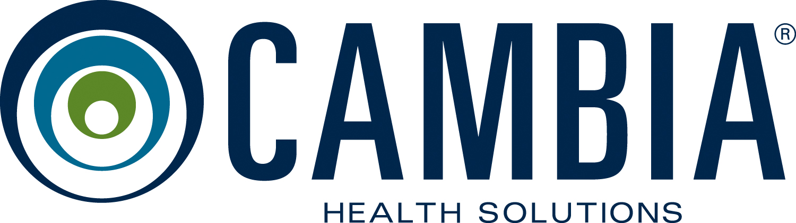
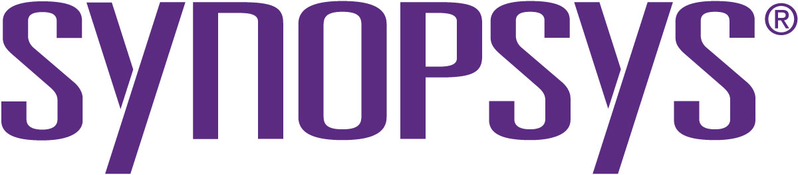

# Training Day
For the fifth year, the Portland OWASP chapter is proud to host our information security training day! This will be an excellent opportunity for the local Portland security community to receive top quality information security and application security training for prices far lower than normally offered. This year's training day will be a fully virtual event which includes a morning keynote, two morning sessions, a lunch panel, two afternoon sessions, and an all-day CTF.

The 5th annual OWASP Portland 2021 Training Day date will be on October 13, 2021.

Want to get news and information on our 2021 Training Day? Subscribe to the [Portland OWASP mailing list](https://groups.google.com/a/owasp.org/forum/#!forum/portland-chapter) or follow [@PortlandOWASP](https://twitter.com/owaspportland) on Twitter!

## Courses
Courses will be held in two tracks: Morning sessions and Afternoon sessions. Each participant can register for one morning course, one afternoon course, or one of each. The maximum total number of courses you may register for is two, that is if you choose one in the morning and one in the afternoon.

### Intro to pen testing and burp - Debolina De
#### Bio
Debolina is an experienced cybersecurity researcher and now professional driven by curiosity and a motto of knowledge being timeless. Having keen interest and acquired knowledge in security , she joined Ernst and Young as a CyberSecurity consultant where she had multiple Fortune 500 companies as her playground as part of their Center of Excellence. She then moved into the depths, actively researching IOT and 5G security under some of the brightest minds at Johns Hopkins University. The recognized results gave her the opportunity to interact and share her observations with peers across the globe as a speaker at the Grace Hopper. She now continues to do so at multiple conferences and has even joined Synopsys, California in their efforts to provide the best security in multiple platforms and paradigms.

#### Talk Description
The session aims to cover security at varied depths starting with an initial understanding of priorities in cybersecurity as well as vulnerability trends on multiple platforms. An in-depth workshop for tool: Burp Suite that not only highlights the usage of the tool as a powerful interceptor but also insight into what plays in one’s mind at various stages of the application given the opportunity to mend its behavior. This should help developers think what must be taken care of from the very initial stages of application planning. The platform would be open to approaches and experienced observations in both ways.

### Threat modeling with Threat Dragon - Jon Gadsden
#### Bio
Jon is a software security engineer at ForgeRock with over eight years of experience in product security. He is more of a defender than an attacker, and concentrates on encouraging a secure development lifecycle within development teams - and in particular threat modeling. Jon has been a long term contributor to the OWASP Threat Dragon open source project and is co-leader of the project alongside Mike Goodwin, the founder of Threat Dragon. His interest in threat modeling started when he saw that it was an often neglected activity in the secure lifecycle, which puzzled him because it is a wide ranging task that is popular with development teams. From that time he has not looked back and works on threat modeling tools, presents threat modeling at OWASP chapter meetings and reassures development teams that threat modeling is both enjoyable and useful.

#### Talk Description
OWASP Threat Dragon is a tool used to help create threat models, usually as part of a secure software development lifecycle. It is a tool that has been written with a focus on simplicity and accessibility which makes it popular among development teams. This workshop session will be useful for engineers and managers alike who want to find out what Threat Dragon is and to then go on to create a real world threat model. No prior experience with Threat Dragon is necessary but a basic knowledge of threat modeling and risk analysis would certainly be an advantage. The workshop will start off with installation and running of Threat Dragon and then move on to interactively showcasing the various features of the tool. Once basic proficiency is gained then there is a run through of a simple threat model and then finishing off with a practical model. Questions are encouraged throughout the workshop and it is sure to be an interactive and fun session.

### Google Cloud Platform Security - Wu-chang Feng & Wenjing Wu
#### Bio - Wu-chang Feng
Wu-chang Feng is a professor in the Department of Computer Science at Portland State University where he works on topics in cloud computing and security.  His current projects include developing CTFs and codelabs to teach advanced topics in security as well as performing outreach to high-schools via camps and internships through CyberPDX and Saturday Academy.

#### Bio - Wenjing Wu
Current PHD student at PSU

#### Talk Description
Organizations have rapidly shifted infrastructure and applications over to public cloud computing services such as AWS, Google Cloud Platform, and Azure. Unfortunately, such services have security models that are substantially different and more complex than traditional enterprise security models. As a result, misconfiguration errors in cloud deployments have led to dozens of well-publicized breaches. In this workshop, we will walkthrough levels of Thunder CTF, a scaffolded, scenario-based CTF for helping students learn about and practice cloud security skills on Google Cloud Platform. Thunder CTF contains both an attack path and a forensic path to allow players to role-play both an offensive and defensive role in the cloud.  The workshop will require access to a Google Cloud Platform account.

### AWS Security - Andrew Krug 
#### Bio
Andrew Krug is a Security Engineer specializing in Cloud Security and Identity and Access Management. Krug also works as a Cloud Security consultant and started the ThreatResponse project a toolkit for Amazon Web Services first responders. Krug has been a speaker at Black Hat USA, DerbyCon, and BSides PDX.

#### Talk Description
In this training session you’ll learn the basics of starting up an AWS Account.  What to enable, disable, and lock down.  We’ll wrap up the session with a little log exercise.  Participants will need to have a brand new AWS Account registered already to a valid email address in order to participate.  This is notably content in short-form from one of the days of https://wildwesthackinfest.com/antisyphon/securing-the-cloud/ -- Also taught by the instructor.

## 2021 Sponsors

### Keynote Sponsors

### Training Session Sponsors

### CTF Sponsors

### Lunch Panel Sponsors

### Schedule

| Time | Course | Course | CTF |
|------|----------|-|-|
| 8:30 AM - 9:20 AM  | Keynote | | |
| 9:30 AM - 12:00 PM | Course TBD | Course TBD | CTF |
| 12:15 PM - 1:15 PM | Lunch Panel | | |
| 1:30 PM - 4:00 PM  | Course TBD | Course TBD | CTF |

## How to Register
* TBD

Thank you to the OWASP Foundation and the many sponsors, trainers, volunteers and trainers that have helped make Training Day a success and allow us to continue!
